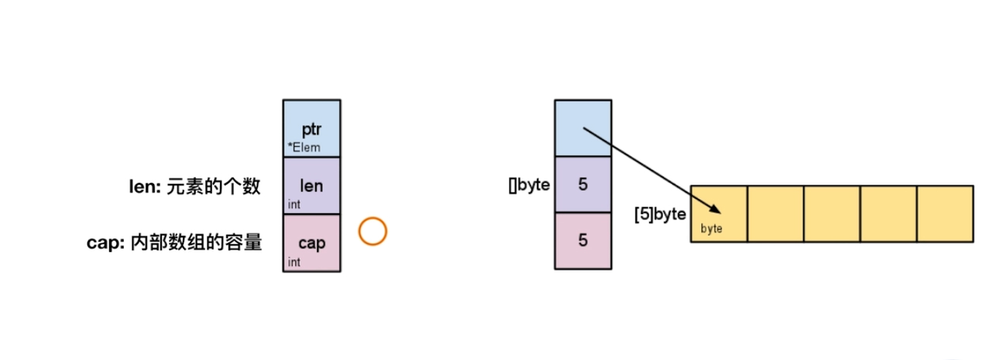
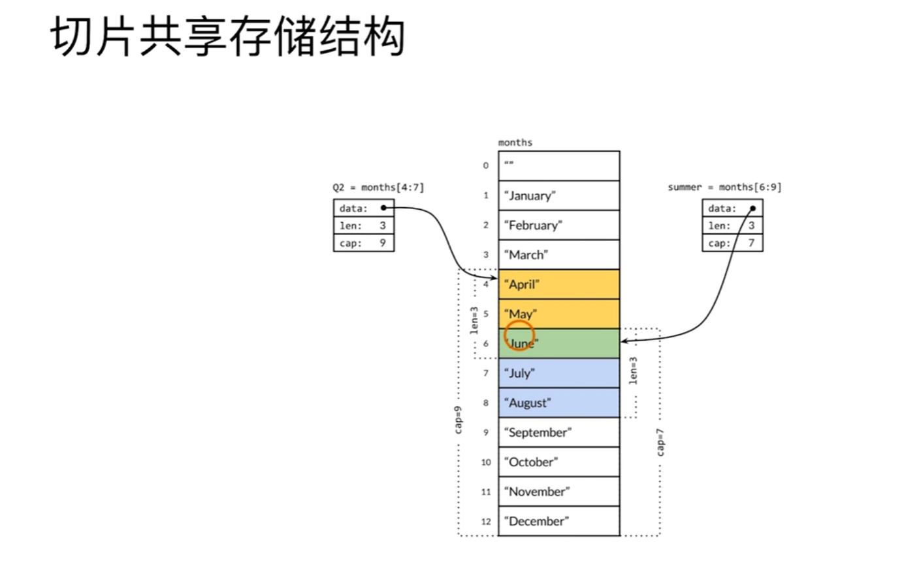

## golang study notes

> The master has failed more times than the beginner has tried.

### go 语言的诞生背景

1. 多核硬件架构
2. 超大规模分布式计算集群
3. web 模式下的新开发规模和迭代速度

---

### 创始人

1. Rob Pike
2. Ken Thompson
3. Robert Griesemer

### 特点

1. 简单(关键字很少)
2. 高效(gc,指针,原生支持并发)
3. 云计算语言
4. 区块链语言

---

### main 函数

1. package 必须为 main 包
2. func 必须为 main 函数
3. main 函数无参数无返回值
4. 通过`os.Exit`返回状态
5. 通过`os.Args`获取命令行参数

---

### 类型转换

1. go 语言不允许隐式类型转换
2. 自定义类型别名也不能隐式转换

---

### 字符串

1. 字符串是数值类型
2. 字符串默认值为空字符,不是**nil**

---

### slice

简单可以理解为可变长度的数组

1. **len** 表示切片内可访问的元素长度
2. **cap** 表示切片的可拓展容量,`cap = cap \* 2`
3. **slice**只能与**nil**比较



---

### 切片共享数据



---

### Map

1. 键值对的数据结构
2. 初始化 len 没有意义,因为`key-value`结构并不能是默认值
3. `Map` 不能使用 `cap()`函数求容量 **Map 声明**:

Map 声明:

```go
// 1.var 关键字
var m = map[string]int{}

// 2.简写
m1 := map[string]int{}

// 3.声明并初始化
m2 := map[string]int{"one":1,"two":2}

// 4.make关键字 适合已知容量
m3 := make(map[string]int,10,/*cap*/)

```

Map 实现 Set:

```go

func TestMapForSet(t *testing.T) {
	mySet := map[int]string{1: "true", 2: "true", 0: "false"}

	n := 5
	if v, ok := mySet[n]; ok {
		t.Logf("%s is existing", v)
	} else {
		// 添加k-v
		t.Log("k-v no existing...")
		t.Logf("append myset[%d]=%s...", n, "hello")
		mySet[n] = "hello"
		t.Log("append finish...")
	}

	t.Log(mySet)
}


```
